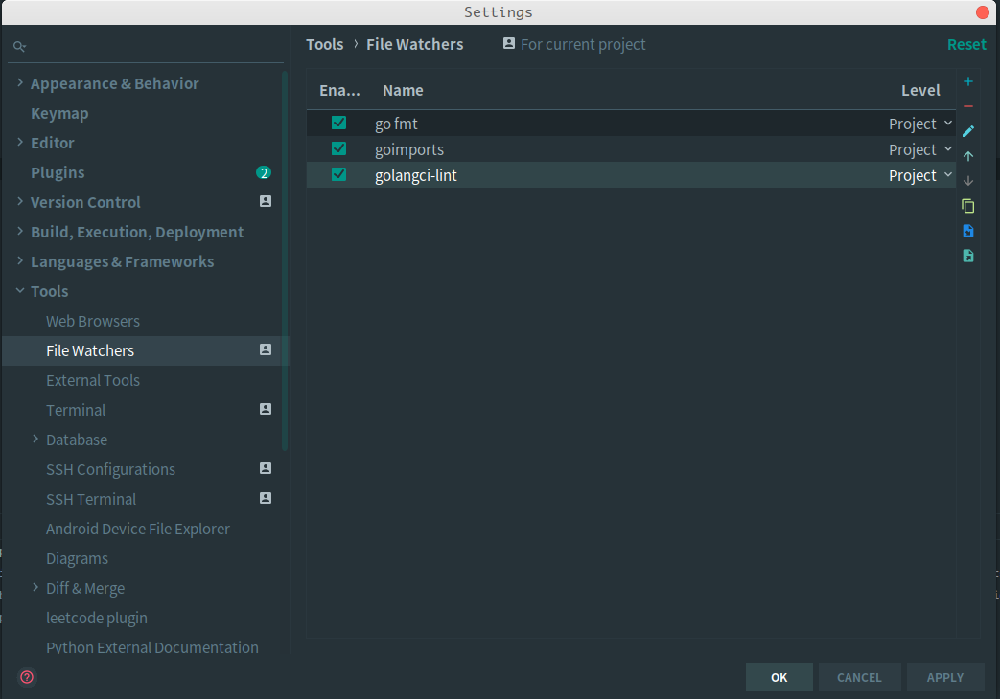
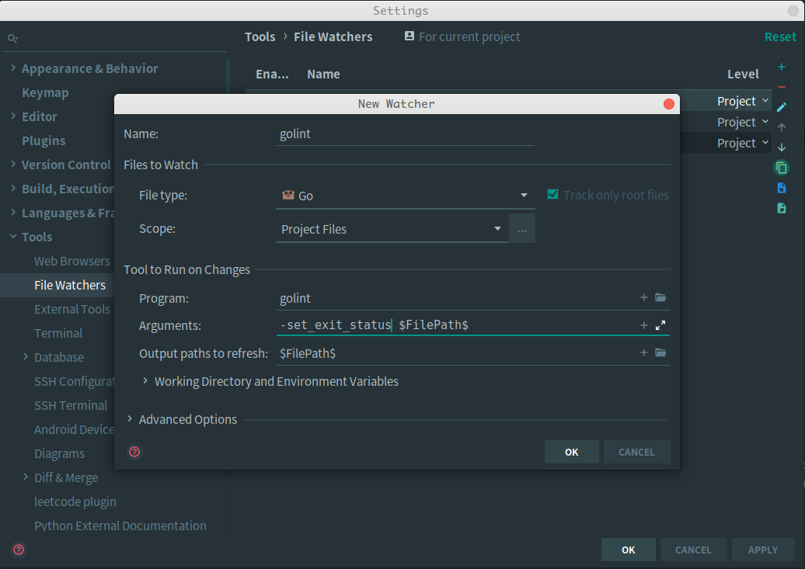

# Go

## 开发环境

### 源码安装

- 安装依赖

```shell
yum install gcc gcc-c++ libxml2 libxml2-devel autoconf
```

- 安装 Go

```shell
wget https://dl.google.com/go/go1.14.2.linux-amd64.tar.gz
tar zxvf go1.14.2.linux-amd64.tar.gz -C /usr/local/
```

### 环境变量

```shell
vim /etc/profile
#添加以下内容
export GOROOT=/usr/local/go
export GOPATH=$HOME/go
export PATH=$PATH:$GOROOT/bin:$GOPATH/bin
#生效配置
source /etc/profile
```

- GO111MODULE

这个环境变量主要是 Go modules 的开关，主要有以下参数：

- auto：只在项目包含了 go.mod 文件时启用 Go modules，在 Go 1.13 中仍然是默认值

- on：启用 Go modules，推荐设置，未来版本中的默认值，让 GOPATH 从此成为历史

- off：禁用 Go modules

#### 参考: [https://github.com/golang/go/issues/31857](https://github.com/golang/go/issues/31857)

```shell
go env -w GO111MODULE=on
```

- GOPROXY

这个环境变量主要是用于设置 Go 模块代理

- 用于使 Go 在后续拉取模块版本时能够脱离传统的 VCS 方式从镜像站点快速拉取

```shell
go env -w GOPROXY=https://goproxy.cn,direct
```

- 使用 GitHub 私有仓库

```shell
go mod init github.com/lalifeier/demo-module

go env -w GOPRIVATE=github.com/lalifeier

# git config --global --add url."git@github.com:lalifeier".insteadOf "https://github.com/lalifeier"
git config --global --add url."git@github.com:".insteadOf "https://github.com/"
```

#### 参考:

- [https://golang.org/dl/](https://golang.org/dl/)
- [https://golang.google.cn/dl/](https://golang.google.cn/dl/)

### 常用包安装

```shell
mkdir -p $GOPATH/src/golang.org/x
git clone https://github.com/golang/tools.git $GOPATH/src/golang.org/x/tools
git clone https://github.com/golang/net.git $GOPATH/src/golang.org/x/net
git clone https://github.com/golang/lint.git $GOPATH/src/golang.org/x/lint
git clone https://github.com/golang/image.git $GOPATH/src/golang.org/x/image
```

### vscode 配置

#### 安装 go 插件

在 vscode 中点击扩展按钮，搜索 go，安装 go 插件

#### 安装 go 工具

在 vscode 中按下 F1 或 Ctrl+Shift+P，输入 Go:Install/Update Tools 回车

### idea 配置

- go fmt : 统一的代码格式化工具（必须）。
- golangci-lint : 静态代码质量检测工具，用于包的质量分析（推荐）。
- goimports : 自动 import 依赖包工具（可选）。
- golint : 代码规范检测，并且也检测单文件的代码质量，比较出名的 Go 质量评估站点 Go Report 在使用（可选）。

1. 在 idea 的设置中，选择 Tools - File Watchers, 依次点击添加这 3 个工具



2. golint 配置

复制 go fmt 的配置，修改 Name, Program, Arguments 三项配置，其中 Arguments 需要加上`-set_exit_status`参数



## go-micro

### 开发环境

- 安装 protoc-gen-micro

```shell
# Protobuf
apt install -y protobuf-compiler
protoc --version  # Ensure compiler version is 3+

wget https://github.com/protocolbuffers/protobuf/releases/download/v3.14.0/protoc-3.14.0-linux-x86_64.zip
# sudo unzip protoc-3.14.0-linux-x86_64.zip -d /usr/local/protoc-3.14.0-linux-x86_64
unzip protoc-3.14.0-linux-x86_64.zip -d protoc-3.14.0-linux-x86_64
sudo mv protoc-3.14.0-linux-x86_64 /usr/local/protoc-3.14.0-linux-x86_64

vim /etc/profile
#添加以下内容
PATH=$PATH:/usr/local/protoc-3.14.0-linux-x86_64/bin
export PATH
#生效配置
source /etc/profile

protoc --version

# protoc-gen-go
go get github.com/golang/protobuf/protoc-gen-go

# protoc-gen-micro
go get github.com/micro/protoc-gen-micro
```

```shell
# https://github.com/microhq/protoc-gen-micro

# greeter.proto
syntax = "proto3";

service Greeter {
	rpc Hello(Request) returns (Response) {}
}

message Request {
	string name = 1;
}

message Response {
	string msg = 1;
}

protoc --proto_path=$GOPATH/src:. --micro_out=. --go_out=. *.proto
```

- 安装 Go Micro

```shell
# Micro 工具集 https://github.com/micro/micro
go get github.com/micro/micro/v3
micro --version

# micro new user/api --type=api --alias=user --namespace=github.com/lalifeier --gopath=false

# Run the server locally
micro server

# Set the environment to local (127.0.0.1:8081)
micro env set local


# generate a service (follow instructions in output)
micro new helloworld

# run the service
micro run helloworld

# check the status
micro status

# list running services
micro services

# call the service
micro helloworld --name=Alice

# curl via the api
curl -d '{"name": "Alice"}' http://localhost:8080/helloworld
```

- 安装 Consul

```shell
wget https://releases.hashicorp.com/consul/1.9.3/consul_1.9.3_linux_amd64.zip
unzip consul_1.9.3_linux_amd64.zip consul_1.9.3_linux_amd64
sudo mv consul_1.9.3_linux_amd64 /usr/local/consul_1.9.3_linux_amd64

vim /etc/profile
#添加以下内容
PATH=$PATH:/usr/local/consul_1.9.3_linux_amd64/bin
export PATH
#生效配置
source /etc/profile

consul version
```
